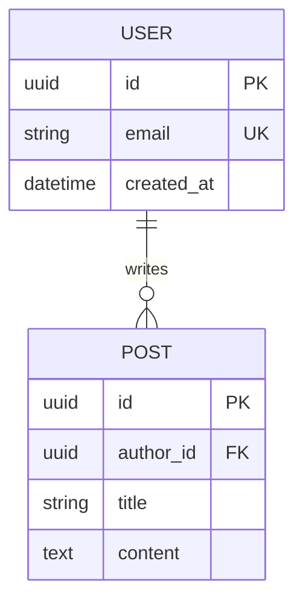
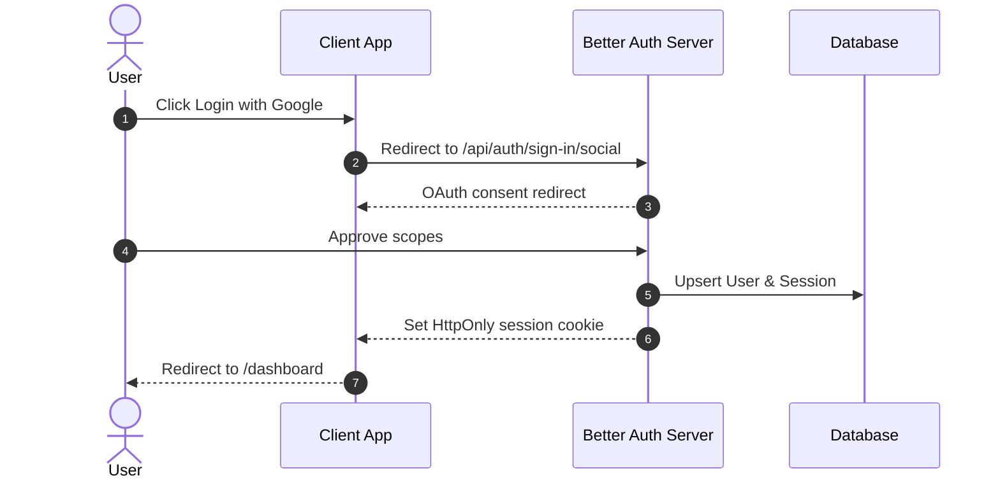
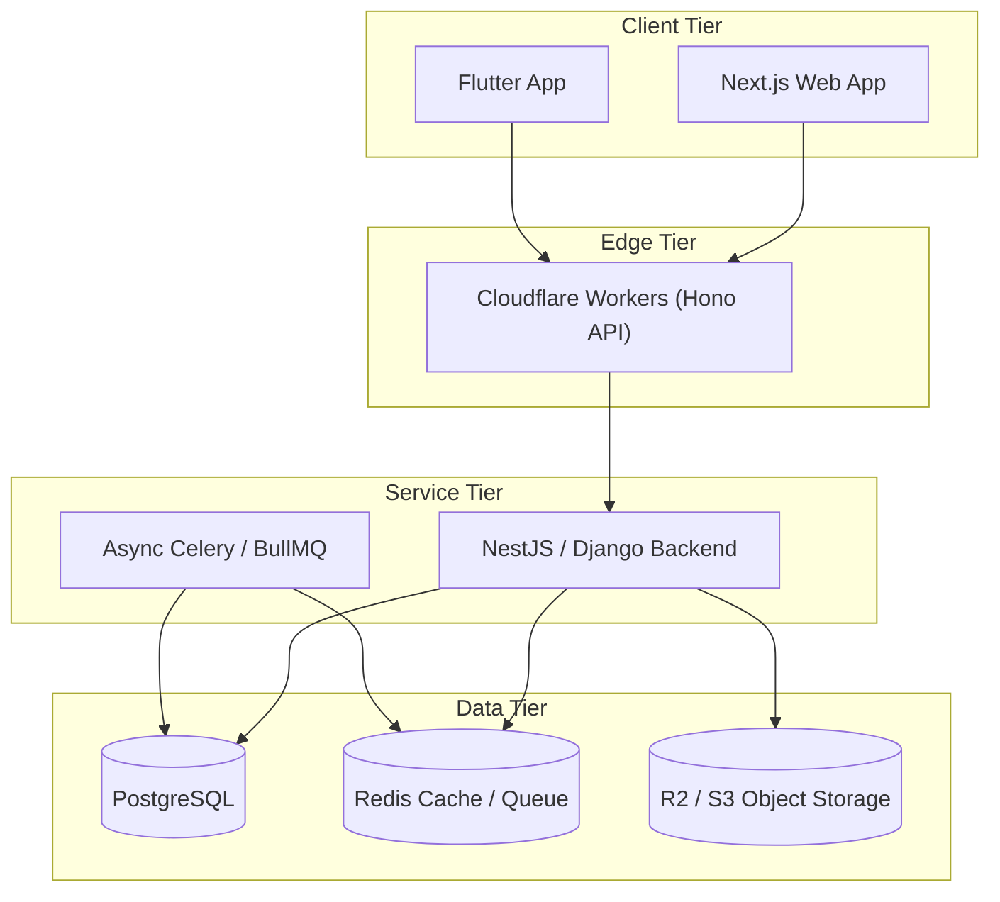

# Mermaid Architect

Specialized skill for creating robust, syntactically correct Mermaid.js diagrams for Markdown documentation, PR descriptions, and architectural blueprints.

## Syntax Best Practices

1. **Quote Node Labels**: Always quote labels containing special characters, brackets, or parentheses:
   ```mermaid
   graph TD
     A["Client (Browser / Mobile)"] --> B["API Gateway (Hono / Next.js)"]
   ```
2. **Cardinality in ERDs**:
   - `||--||` : Exactly one to one
   - `||--o{` : One to zero-or-more
   - `||--|{` : One to one-or-more
   - `}o--o{` : Zero-or-more to zero-or-more

---

## Supported Diagram Types

### 1. Entity Relationship Diagram (ERD)


### 2. Sequence Diagram (Auth & API Flow)


### 3. C4 / System Topology Flowchart

